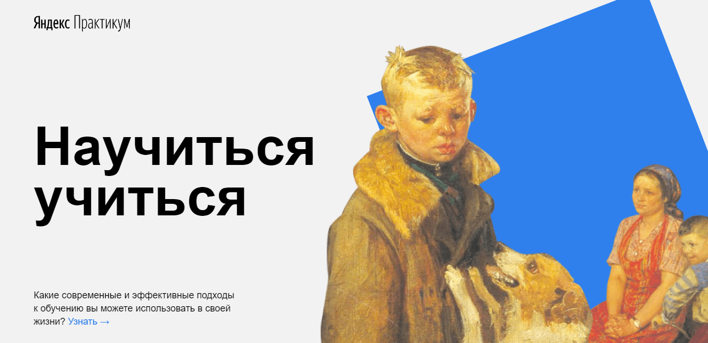

# Проектная работа: «Научиться учиться». 

## Описание

Типовой лэндинг про методики обучения. Создан по методологии BEM с файловой структурой Nested BEM. 
Сайт подготовлен в рамках курса [Яндекс.Практикум](https://practicum.yandex.ru/) факультета [«Веб-разработчик».](https://practicum.yandex.ru/web/)

## Стек
* HTML
* CSS

## Планы по доработке
* Адаптивная верстка сайта
* Добавление формы обратной связи

## Демо

